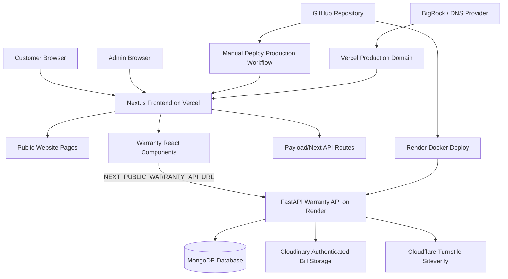
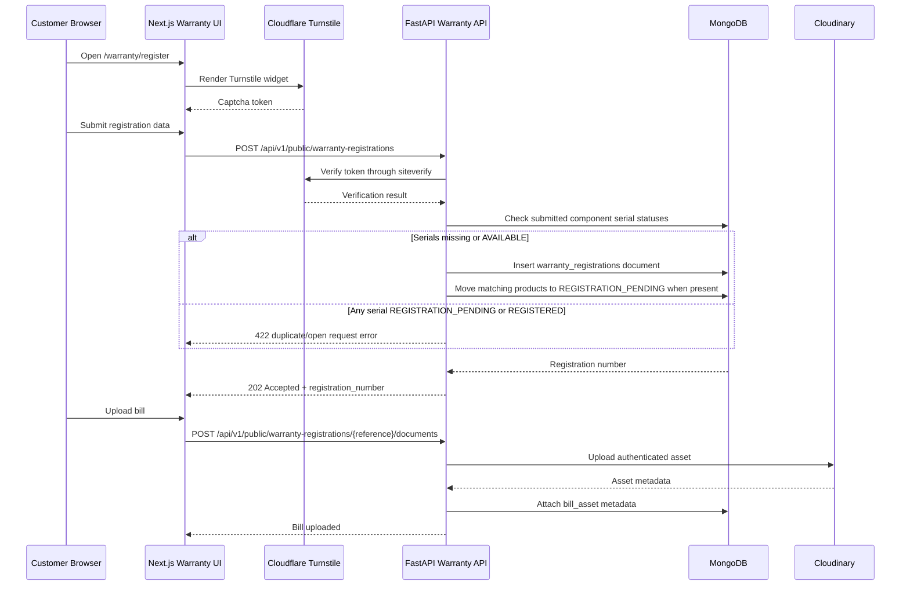
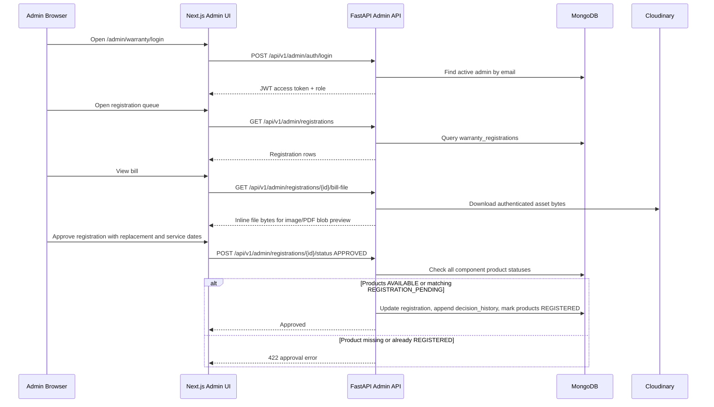
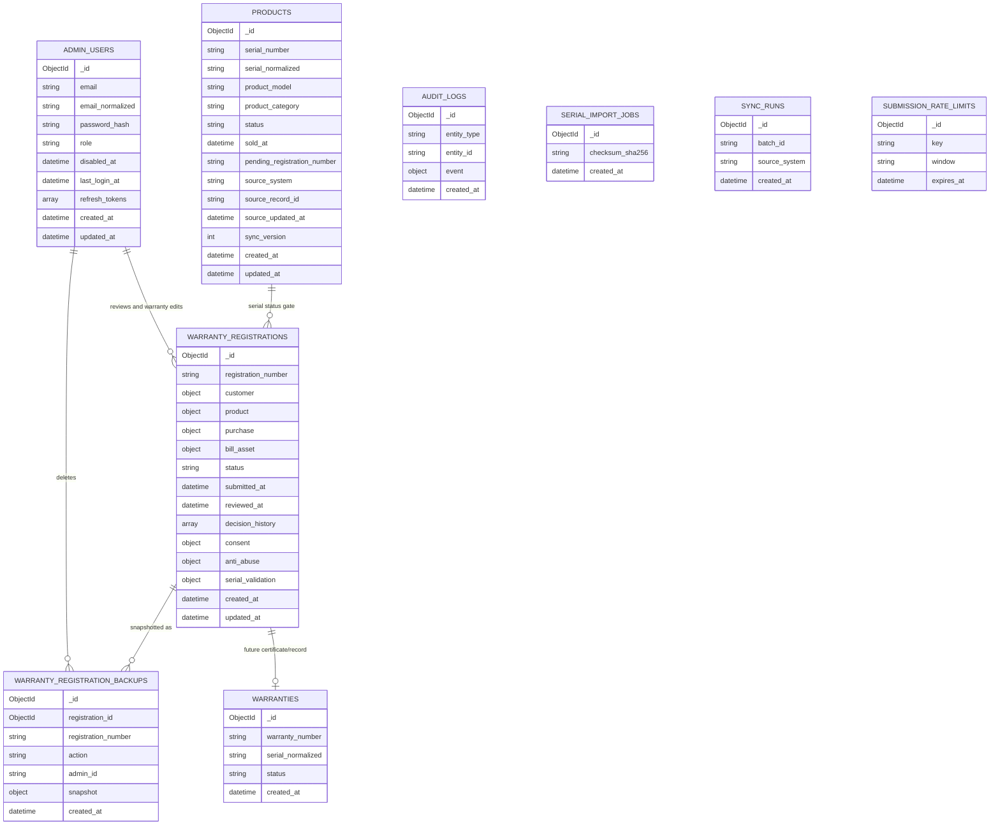
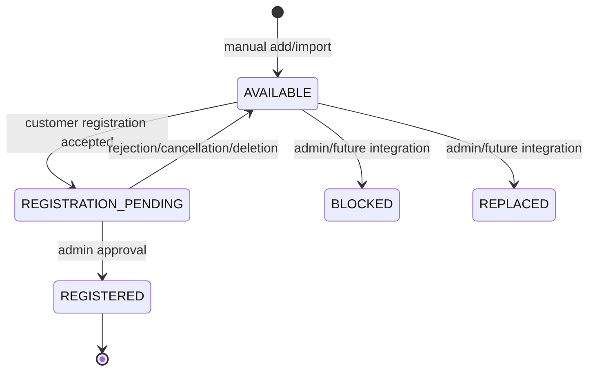

# Limac Warranty Platform Design Document

Last updated: 2026-08-23

## 1. Purpose

This document describes the current Limac website and warranty registration platform architecture, including frontend, backend, database, storage, security, deployment, and future roadmap. It is intended for developers, maintainers, deployment operators, and stakeholders who need a single reference for how the current version works and what is planned next.

Production secrets must not be committed to this repository. Environment values in this document are examples or placeholders only.

## 2. System Overview

The project contains two main runtime surfaces:

- Main public website: Next.js App Router application deployed to Vercel.
- Warranty backend: FastAPI service deployed to Render and backed by MongoDB.

The public warranty pages are part of the Next.js website, but all warranty business logic is handled by the FastAPI backend. The frontend calls the backend through `NEXT_PUBLIC_WARRANTY_API_URL`.

### Key Runtime Components

| Component | Technology | Runtime | Responsibility |
| --- | --- | --- | --- |
| Public website | Next.js, React, TypeScript, Tailwind | Vercel | Marketing pages, product pages, blog, warranty UI |
| Warranty frontend | Next.js client components | Vercel/browser | Registration form, status lookup, admin UI |
| Warranty API | FastAPI, Pydantic, Motor | Render Docker service | Registration, admin auth, product serial database, review actions, change log, warranty dashboard, serial import, CSV export |
| Database | MongoDB | Atlas or local Docker | Warranty records, products, admin users, audit/backup data |
| Bill storage | Cloudinary authenticated assets | Cloudinary | Secure warranty bill storage for backend-proxied image/PDF preview |
| Captcha | Cloudflare Turnstile | Cloudflare | Public registration bot protection |
| Domain/DNS | BigRock or DNS provider, Vercel DNS records | DNS | Routes public domain to Vercel |
| Production deploy workflow | GitHub Actions + Vercel CLI | GitHub Actions | Manual Vercel production deployment |

## 3. Component Model



## 4. Repository Structure

| Path | Purpose |
| --- | --- |
| `src/app/` | Next.js App Router routes |
| `src/app/(site)/warranty/register/page.tsx` | Public warranty registration route |
| `src/app/(site)/warranty/status/page.tsx` | Public status lookup route |
| `src/app/admin/warranty/login/page.tsx` | Admin login route |
| `src/app/admin/warranty/registrations/page.tsx` | Admin registration queue |
| `src/app/admin/warranty/registrations/[id]/page.tsx` | Admin registration detail |
| `src/app/admin/warranty/products/page.tsx` | Product serial database management |
| `src/app/admin/warranty/users/page.tsx` | Super admin user management |
| `src/app/admin/warranty/serial-imports/page.tsx` | Serial import admin route |
| `src/app/(site)/privacy-policy/page.tsx` | Public privacy policy, including warranty registration data section |
| `src/components/warranty/` | Warranty frontend components |
| `src/services/warrantyApi.ts` | Browser API client for FastAPI |
| `src/types/warranty.ts` | Frontend warranty contracts |
| `backend/app/` | FastAPI backend source |
| `backend/app/api/public/` | Public warranty API routes |
| `backend/app/api/admin/` | Admin API routes |
| `backend/app/repositories/` | MongoDB repository layer |
| `backend/app/services/` | Business services |
| `backend/app/security/` | Password, JWT, admin auth dependencies |
| `backend/app/storage/` | Cloudinary integration |
| `backend/tests/` | Backend tests |
| `docs/` | Architecture and deployment documentation |

## 5. Feature Specification

### 5.1 Public Warranty Registration

Available in current version:

- Customer submits warranty registration details.
- Required customer fields:
  - Name
  - Address line
  - City
  - State
  - PIN code
  - Mobile number
- Required product/purchase fields:
  - One or more product/component serial numbers
  - Purchase date
  - Invoice number
  - Dealer / Care of
- Optional fields:
  - Product model
  - Dealer code
- Dealer / Care of and purchase fields include helper hints in the UI.
- Customer must accept warranty terms and privacy policy.
- Privacy policy consent links to the public `/privacy-policy` page.
- Cloudflare Turnstile token is required when `TURNSTILE_REQUIRED=true`.
- Backend checks all submitted component serials against the Limac product database for duplicate/open-request protection.
- If a serial is missing from the product database, registration is allowed and held for manual review.
- If all matching serials exist with `AVAILABLE`, registration is allowed and matching products are moved to `REGISTRATION_PENDING`.
- If any serial exists with `REGISTRATION_PENDING`, registration is blocked because a request is already open.
- If any serial exists with `REGISTERED`, registration is blocked because warranty is already assigned.
- Backend creates a pending registration with a generated reference number.
- Customer uploads bill/invoice document after registration.
- Supported bill file types:
  - JPG
  - PNG
  - PDF
- Maximum upload size is controlled by `MAX_UPLOAD_BYTES`, currently defaulting to 2 MB.
- Uploaded bills are stored in Cloudinary as authenticated assets.

Planned future version:

- Direct bill upload as part of the first registration submission.
- Stronger rate limiting enforcement using `submission_rate_limits`.
- Customer notification after submission or approval.
- Improved duplicate registration guidance.
- OTP or alternate identity verification only if explicitly approved for a later version.

### 5.2 Public Status Lookup

Available in current version:

- Customer can look up a registration by registration reference.
- Lookup requires either registered mobile number or serial number.
- Response includes:
  - Registration reference
  - Current status
  - Submitted timestamp
  - Masked mobile
  - Masked serial
  - Status message, when available

Planned future version:

- Warranty certificate download after approval.
- Richer customer-facing status timeline.
- WhatsApp/SMS/email notification links if an approved provider is added.

### 5.3 Admin Authentication

Available in current version:

- Admin login with email and password.
- Passwords are hashed with Argon2.
- JWT access tokens are issued by the backend.
- Frontend stores the access token in `sessionStorage`.
- Frontend session timeout is 5 minutes of inactivity.
- Admin roles:
  - `REVIEWER`
  - `APPROVER`
  - `SUPER_ADMIN`
- Initial production super admin can be bootstrapped through Render environment variables when no admin user exists.

Planned future version:

- Refresh token rotation from the frontend.
- Password change flow for the current admin user.
- Admin disable/reactivate flow.
- Global audit trail UI for admin activity beyond the current per-registration change log.
- Multi-factor authentication.

### 5.4 Admin Registration Review

Available in current version:

- Admins can list warranty registrations.
- Queue supports filtering by status.
- Queue supports searching by customer name, mobile number, registration number, and serial.
- Queue includes four warranty dashboard tiles visible to all admin users:
  - Replacement warranty expired
  - Service warranty expired
  - Replacement warranty under warranty
  - Service warranty under warranty
- Clicking a warranty dashboard tile loads matching approved records and sorts by the relevant warranty expiry date.
- Admins can open detail views.
- Admins can view uploaded bills through the backend bill-file proxy. The UI supports image and PDF preview, shows a loading indicator while Cloudinary data is fetched, and offers opening PDFs in a new tab from a browser blob URL.
- Admin registration detail performs a fresh current lookup against the Limac product database, rather than relying only on the original registration snapshot.
- Admins can update registration status.
- Approval requires every submitted component serial to exist in the Limac product database and not already be `REGISTERED` for a different warranty.
- Approval requires both `replacement_warranty_expiry_date` and `service_warranty_expiry_date`.
- Replacement and service warranty expiry dates cannot be earlier than the purchase date.
- Approval changes all matching component product statuses to `REGISTERED`.
- Admins/approvers can update replacement and service warranty dates later for approved records.
- Warranty date changes are appended to each registration's decision history.
- Rejection, cancellation, or deletion releases matching `REGISTRATION_PENDING` products back to `AVAILABLE`.
- Reason is required for:
  - `REJECTED`
  - `MORE_INFORMATION_REQUIRED`
- Super admins can delete registrations.
- Deleted registrations are removed from the live dashboard but preserved in backup snapshots.
- CSV export includes live records and deleted backup snapshots. Deleted exported rows are marked with `status=DELETED`.
- CSV export includes `replacement_warranty_expiry_date` and `service_warranty_expiry_date`; the legacy `warranty_expiry_date` column is no longer exported.
- Change log query is available from the admin registration page with pagination. It searches by serial number, mobile number, customer name, and registration reference, and returns only change-log entries rather than loading the full registration table.

Current statuses:

- `PENDING`
- `UNDER_REVIEW`
- `MORE_INFORMATION_REQUIRED`
- `APPROVED`
- `REJECTED`
- `CANCELLED`

Planned future version:

- Full approval workflow that creates a warranty record.
- Conflict handling when another warranty already exists for a serial.
- Dedicated review-start, approve, reject, and request-information endpoints replacing generic status updates.
- Warranty certificate generation.
- Repair/reconciliation command for partial approval states.

### 5.5 Admin User Management

Available in current version:

- Only `SUPER_ADMIN` can access admin user management APIs.
- Super admins can create:
  - `APPROVER`
  - `SUPER_ADMIN`
- Super admins can reset another admin user's password.
- Frontend protects the users page from rendering to non-super-admin users.

Planned future version:

- Disable/reactivate admin users.
- Role change history.
- Self-service password change.
- Invite flow instead of temporary password creation.

### 5.6 Product Serial Import

Available in current version:

- Product serials are stored in the MongoDB `products` collection, which acts as the Limac product database.
- Manager/approver and super admin users can manually add or update product serials from `/admin/warranty/products`.
- Manual product entry captures:
  - Serial number
  - Product model
  - Sold date
- Sold date cannot be greater than the current date.
- New manual product entries default to `AVAILABLE`.
- Super admins can delete product serials from the product database.
- Super admins can upload CSV/XLSX serial import files.
- Import supports dry-run mode.
- Import service validates required headers.
- Product records are inserted or updated in MongoDB.
- CSV/XLSX imported products also default to `AVAILABLE`.
- Import checksum is calculated for traceability.

Current product statuses:

- `AVAILABLE`: serial can be used for a new warranty registration.
- `REGISTRATION_PENDING`: a warranty registration request is already open for this serial.
- `REGISTERED`: warranty is already assigned; future registration/approval is blocked.
- `BLOCKED`: serial is administratively blocked.
- `REPLACED`: serial has been replaced.

Planned future version:

- Persisted serial import job detail lookup.
- Row-level import report download.
- Scheduled import from ERP/Tally.
- Admin UI for import history.

### 5.7 Integrations

Available in current version:

- Tally integration route scaffold exists behind configuration.
- No outbound warranty notification provider is required in V1.
- Existing website enquiry email may use Resend, but warranty V1 does not depend on email.

Planned future version:

- Tally or ERP product-master sync.
- Notification provider integration.
- Sentry or equivalent production error monitoring.

### 5.8 Current Warranty Pages

Public pages:

- `/warranty/register`: customer warranty registration, multiple component serial entry, bill upload handoff, warranty/privacy consent.
- `/warranty/status`: customer status lookup by reference plus mobile or serial.
- `/warranty/submitted`: submission acknowledgement.
- `/privacy-policy`: public privacy policy with a warranty registration data section.

Admin pages:

- `/admin/warranty/login`: admin login.
- `/admin/warranty/registrations`: admin home/dashboard, status filters, warranty summary tiles, search, change-log query, CSV export, bill preview, and registration actions.
- `/admin/warranty/registrations/[id]`: registration detail, status changes, bill preview, warranty date updates, decision history, and deletion for authorized users.
- `/admin/warranty/products`: product serial database management.
- `/admin/warranty/users`: super-admin user creation and password reset.
- `/admin/warranty/serial-imports`: serial import route for future/import workflow.

Admin subpages include a clear `Admin home` action that returns to `/admin/warranty/registrations`.

## 6. Data Flow

### Public Registration Flow



### Admin Review Flow



## 7. Database Design

MongoDB is initialized on backend startup. Index creation is idempotent and handled by `backend/app/database.py`.

### Database Component Model



### Collections and Indexes

| Collection | Important Indexes | Purpose |
| --- | --- | --- |
| `products` | Unique `serial_normalized`; `status, updated_at`; `source_system, source_record_id` | Limac product database for manual entry, imports, duplicate request blocking, and approval checks |
| `warranty_registrations` | Unique `registration_number`; `status, submitted_at`; `serial_normalized, submitted_at`; `product.components.serial_normalized, submitted_at`; `purchase.invoice_number`; `anti_abuse.idempotency_hash` | Live registration queue, component serial lookup, review dashboard, and change log |
| `warranty_registration_backups` | `registration_number, created_at`; `action, created_at`; `created_at` | Snapshot history and deleted export recovery |
| `warranties` | Unique `warranty_number`; unique `serial_normalized`; `status, created_at` | Future approved warranty records |
| `admin_users` | Unique `email_normalized`; `role, disabled_at` | Admin authentication and authorization |
| `audit_logs` | `entity_type, entity_id`; `created_at` | Future audit history |
| `serial_import_jobs` | `checksum_sha256`; `created_at` | Serial import tracking |
| `sync_runs` | Unique `batch_id`; `source_system, created_at` | Future ERP/Tally sync runs |
| `submission_rate_limits` | Unique `key, window`; TTL `expires_at` | Future abuse controls |

### Product Database Fields

The `products` collection is the Limac product serial database used by manual entry, CSV/XLSX import, future Tally sync, public registration duplicate checks, and admin approval checks.

| Field | Purpose |
| --- | --- |
| `serial_number` | Original serial value entered/imported |
| `serial_normalized` | Uppercase, whitespace-free serial used for matching |
| `product_model` | Product model used by admin review and future integrations |
| `sold_at` | Sold date to dealer/user; cannot be greater than current date for manual entry |
| `status` | Product lifecycle state: `AVAILABLE`, `REGISTRATION_PENDING`, `REGISTERED`, `BLOCKED`, `REPLACED` |
| `pending_registration_number` | Registration reference currently holding this serial while status is `REGISTRATION_PENDING` |
| `source_system` | `MANUAL_ADMIN`, `INITIAL_EXPORT`, or future integration source such as Tally |
| `source_record_id` | Source-side stable identifier when available |
| `source_updated_at` | Timestamp from source system when available |
| `sync_version` | Incremented when imported/synced data changes |

### Warranty Registration Fields

The `warranty_registrations` collection stores the live registration queue and the per-registration audit trail used by admin review.

| Field | Purpose |
| --- | --- |
| `registration_number` | Human-readable reference such as `LIMAC-REG-2026-000012` |
| `customer` | Name, address, city, state, PIN code, mobile number, and normalized mobile |
| `product.serial_number` | Legacy/primary serial value, currently the first submitted component serial |
| `product.serial_normalized` | Normalized primary serial used by older queries and compatibility paths |
| `product.components[]` | Current multi-component serial model. Each component stores `serial_number` and `serial_normalized` |
| `purchase.purchase_date` | Customer-entered purchase date |
| `purchase.invoice_number` | Customer-entered invoice number |
| `purchase.dealer_name` | Dealer / Care of value |
| `purchase.dealer_code` | Optional dealer code |
| `purchase.replacement_warranty_expiry_date` | Admin-entered replacement warranty expiry date for approved records |
| `purchase.service_warranty_expiry_date` | Admin-entered service warranty expiry date for approved records |
| `bill_asset` | Cloudinary asset metadata for image/PDF bill files; MongoDB does not store the bill bytes |
| `status` | Current registration status |
| `decision_history[]` | Per-registration change log, including registration received, status updates, approvals, reasons, admin IDs, and warranty date edits |
| `serial_validation` | Snapshot of serial validation result at registration time, including component-level results |
| `consent` | Warranty terms and privacy policy consent flags and versions |
| `anti_abuse` | Idempotency hash and request metadata |

Legacy note: older documents may contain `purchase.warranty_expiry_date`. Current code no longer writes or exports that field. Read paths normalize it into `purchase.replacement_warranty_expiry_date` when needed, and `backend/scripts/backfill_replacement_warranty_dates.py` can backfill old records that contain only the legacy field.

### Backup and Deleted Export Design

Current delete behavior:

1. Super admin requests delete.
2. Backend reads the live registration.
3. Backend writes a snapshot to `warranty_registration_backups` with `action=DELETED`.
4. Backend deletes the live document from `warranty_registrations`.
5. Dashboard no longer shows the row.
6. CSV export reads live rows plus deleted backup snapshots.
7. Deleted CSV rows are exported with `status=DELETED`.

### Product Status Lifecycle



Rules:

- Missing product records do not block customer registration, but they block final approval until the serial is added to the product database.
- Existing `AVAILABLE` records allow registration and are reserved as `REGISTRATION_PENDING`.
- Existing `REGISTRATION_PENDING` records block new registration for the same normalized serial.
- Existing `REGISTERED` records block new registration and approval for the same normalized serial.
- For registrations with multiple component serials, reservation, approval, and release checks run for each component.
- Serial matching is case-insensitive and ignores whitespace because serials are stored and queried with normalized serial fields.

## 8. API Design

### Public API

Base prefix: `/api/v1/public`

| Method | Route | Purpose |
| --- | --- | --- |
| `GET` | `/products/{serial}/validation` | Product serial status lookup |
| `POST` | `/warranty-registrations` | Create pending warranty registration |
| `POST` | `/warranty-registrations/status-lookup` | Customer status lookup |
| `POST` | `/warranty-registrations/{reference}/documents` | Upload bill/invoice |

### Admin API

Base prefix: `/api/v1/admin`

| Method | Route | Required Role | Purpose |
| --- | --- | --- | --- |
| `POST` | `/auth/login` | Active admin | Login |
| `POST` | `/auth/refresh` | Refresh token | Refresh token placeholder/flow |
| `GET` | `/registrations` | Admin | List registration queue |
| `GET` | `/registrations/summary` | Admin | Warranty dashboard counts for replacement/service expired and under-warranty records |
| `GET` | `/registrations/change-log` | Admin | Paginated registration change-log query |
| `GET` | `/registrations/export.csv` | Super admin | Export live and deleted records |
| `GET` | `/registrations/{id}` | Admin | Registration detail |
| `POST` | `/registrations/{id}/status` | Admin | Update status |
| `POST` | `/registrations/{id}/warranty-dates` | Admin | Update replacement and service warranty dates for approved records |
| `DELETE` | `/registrations/{id}` | Super admin | Delete registration with backup |
| `GET` | `/registrations/{id}/bill-access` | Admin | Get signed bill URL |
| `GET` | `/registrations/{id}/bill-file` | Admin | Download authenticated bill bytes through backend for image/PDF preview |
| `GET` | `/products` | Approver or super admin | List/search product serials |
| `POST` | `/products` | Approver or super admin | Add or update product serial |
| `DELETE` | `/products/{id}` | Super admin | Delete product serial |
| `POST` | `/serial-imports` | Super admin | Upload serial import |
| `GET` | `/users` | Super admin | List admin users |
| `POST` | `/users` | Super admin | Create admin user |
| `POST` | `/users/{id}/password` | Super admin | Reset another user's password |

Admin API notes:

- `GET /registrations` supports `status`, `search`, `limit`, `skip`, and `warranty_filter`.
- Supported `warranty_filter` values are `replacement_expired`, `service_expired`, `replacement_under_warranty`, and `service_under_warranty`.
- Warranty-filtered lists include approved records only and are sorted by the relevant replacement or service warranty date.
- `POST /registrations/{id}/status` requires `replacement_warranty_expiry_date` and `service_warranty_expiry_date` when `status=APPROVED`.
- `POST /registrations/{id}/warranty-dates` is available to admin users for approved records and appends a `WARRANTY_DATES_UPDATED` event to `decision_history`.
- `GET /registrations/change-log` supports `search`, `limit`, and `skip` and returns paginated rows with `decision_history`.

## 9. Security Design

### Authentication and Authorization

- Admin passwords are hashed using Argon2.
- Access tokens are JWTs signed with `JWT_SECRET_KEY`.
- Backend role enforcement is implemented through FastAPI dependencies:
  - `require_admin`
  - `require_super_admin`
- Frontend gates protected admin pages to prevent UI flashes before API rejection.
- Sensitive admin actions are enforced server-side, not only in the UI.

### Captcha

- Cloudflare Turnstile protects public registration.
- Frontend uses `NEXT_PUBLIC_TURNSTILE_SITE_KEY`.
- Backend uses `TURNSTILE_SECRET_KEY`.
- Backend verifies tokens through Cloudflare `siteverify`.
- Local development can set `TURNSTILE_REQUIRED=false`.

### Bill Storage

- Bills are not stored directly in MongoDB.
- Bills are uploaded to Cloudinary as authenticated assets.
- MongoDB stores only asset metadata such as public ID, resource type, checksum, size, folder, and content type.
- Admin bill viewing primarily uses the backend `/bill-file` endpoint, which downloads the authenticated Cloudinary asset server-side and returns inline bytes to the browser.
- The admin frontend builds browser blob URLs from the returned bytes for image/PDF preview and shows a loading state while the file is being fetched.
- A signed Cloudinary access helper remains available for provider-level access patterns, but the UI uses the backend proxy to avoid browser-side authenticated raw URL failures.

### CORS

Allowed origins are configured in backend settings:

- `http://localhost:3000`
- `http://127.0.0.1:3000`
- `https://www.limac.in`
- `https://limac.in`

## 10. Environment Variables

### Vercel Frontend Variables

| Variable | Purpose |
| --- | --- |
| `NEXT_PUBLIC_SITE_URL` | Public website URL |
| `NEXT_PUBLIC_WARRANTY_API_URL` | Browser-visible FastAPI base URL |
| `NEXT_PUBLIC_TURNSTILE_SITE_KEY` | Cloudflare Turnstile public key |
| `PAYLOAD_URL` | Payload/website runtime URL |
| `PAYLOAD_SECRET` | Payload secret |
| `PAYLOAD_API_KEY` | Optional Payload API key |
| `MONGODB_URI` | Required only if Vercel runtime uses Payload MongoDB |
| `RESEND_API_KEY` | Existing enquiry email integration, not required by warranty V1 |

### Render Backend Variables

| Variable | Purpose |
| --- | --- |
| `ENVIRONMENT=production` | Production mode |
| `MONGODB_URI` | MongoDB connection string |
| `MONGODB_DATABASE=limac` | Database name |
| `JWT_SECRET_KEY` | JWT signing secret |
| `TURNSTILE_REQUIRED=true` | Captcha requirement |
| `TURNSTILE_SECRET_KEY` | Cloudflare Turnstile secret key |
| `CLOUDINARY_CLOUD_NAME` | Cloudinary cloud name |
| `CLOUDINARY_API_KEY` | Cloudinary API key |
| `CLOUDINARY_API_SECRET` | Cloudinary API secret |
| `CLOUDINARY_BILL_FOLDER_ROOT=limac/warranty-bills` | Bill folder root |
| `INITIAL_ADMIN_EMAIL` | Optional first super admin bootstrap email |
| `INITIAL_ADMIN_PASSWORD` | Optional first super admin bootstrap password; remove after bootstrap |

## 11. Deployment and Setup Steps

### 11.1 Local Development

Frontend:

```bash
npm install
npm run dev
```

Backend:

```bash
cd backend
python -m venv .venv
.venv\Scripts\Activate.ps1
pip install -e ".[dev]"
uvicorn app.main:app --reload
```

Local MongoDB option:

```bash
cd backend
docker compose -f docker-compose.mongo.yml up -d
```

Verification:

```bash
npm run build
cd backend
pytest
```

### 11.2 Vercel Frontend Setup

Current repository behavior:

- `vercel.json` disables automatic Git deployment.
- Production deployment is intended to be manual through GitHub Actions.
- `.github/workflows/deploy-production.yml` builds and deploys with Vercel CLI.

Steps:

1. Create or open the Vercel project.
2. Connect it to the GitHub repository.
3. Confirm framework detection as Next.js.
4. Configure build settings:
   - Install command: `npm install`
   - Build command: `npm run build`
   - Output: `.next`
5. Add frontend environment variables in Vercel.
6. Add production domain in Vercel.
7. Confirm `NEXT_PUBLIC_WARRANTY_API_URL` points to the Render backend URL, ending in `/api/v1`.
8. Add GitHub repository secrets:
   - `VERCEL_TOKEN`
   - `VERCEL_ORG_ID`
   - `VERCEL_PROJECT_ID`
9. Run GitHub Actions workflow `Deploy Production`.
10. Confirm production domain loads and warranty pages call the backend successfully.

### 11.3 Render Backend Setup

Current repository behavior:

- `render.yaml` defines a Docker web service named `limac-warranty-api`.
- Service root directory is `backend`.
- Health check path is `/health/live`.
- Dockerfile runs `uvicorn app.main:app --host 0.0.0.0 --port 8000`.

Steps:

1. Create a Render web service from the repository.
2. Select Docker runtime.
3. Set root directory to `backend`.
4. Use the service name `limac-warranty-api` or equivalent.
5. Configure health check path `/health/live`.
6. Add backend environment variables in Render.
7. Deploy service.
8. Confirm health endpoints:
   - `/health/live`
   - `/health/ready`
9. Confirm API prefix:
   - `/api/v1/public/...`
   - `/api/v1/admin/...`
10. If using bootstrap admin variables, remove `INITIAL_ADMIN_PASSWORD` after the first successful startup.

### 11.4 MongoDB Setup

Steps:

1. Create MongoDB database, usually `limac`.
2. Create an application database user with read/write access to that database.
3. Add connection string to Render as `MONGODB_URI`.
4. Add `MONGODB_DATABASE=limac`.
5. Start backend once to allow index creation.
6. Confirm collections and indexes are created.

Collections are created lazily by MongoDB when first written, but indexes are ensured on startup.

### 11.5 Cloudflare Turnstile Setup

Steps:

1. Open Cloudflare Turnstile.
2. Create a widget for the production domain.
3. Add allowed hostnames:
   - `limac.in`
   - `www.limac.in`
   - local development hostnames if needed
4. Copy the site key into Vercel as `NEXT_PUBLIC_TURNSTILE_SITE_KEY`.
5. Copy the secret key into Render as `TURNSTILE_SECRET_KEY`.
6. Set `TURNSTILE_REQUIRED=true` in Render for production.
7. Test public registration.

Local development option:

```env
TURNSTILE_REQUIRED=false
NEXT_PUBLIC_TURNSTILE_SITE_KEY=
```

### 11.6 Cloudinary Setup

Steps:

1. Create or open the Cloudinary account.
2. Get cloud name, API key, and API secret.
3. Add these values to Render:
   - `CLOUDINARY_CLOUD_NAME`
   - `CLOUDINARY_API_KEY`
   - `CLOUDINARY_API_SECRET`
4. Set folder root:
   - `CLOUDINARY_BILL_FOLDER_ROOT=limac/warranty-bills`
5. Backend uploads bills under:
   - `limac/warranty-bills/YYYY/MM`
6. Confirm uploaded assets use authenticated access.
7. Test admin bill preview; backend should return a signed URL.

### 11.7 Domain and DNS Setup

Steps:

1. Add apex and `www` domains in Vercel.
2. In BigRock or the active DNS provider, set records exactly as shown by Vercel.
3. Preserve existing email records unless intentionally migrating email:
   - MX
   - SPF
   - DKIM
   - DMARC
4. Wait for DNS propagation.
5. Confirm Vercel domain status is valid.
6. Test:
   - `https://limac.in`
   - `https://www.limac.in`

### 11.8 GitHub Actions Deployment

Production workflow:

```text
.github/workflows/deploy-production.yml
```

Steps:

1. Open GitHub Actions.
2. Select `Deploy Production`.
3. Click `Run workflow`.
4. Enter `deploy` as confirmation.
5. Workflow installs dependencies, pulls Vercel production environment, builds, and deploys the prebuilt artifact.

Legacy static workflow:

```text
.github/workflows/publish-pages.yml
```

This is manual-only and intended for legacy GitHub Pages static publishing. It hides server-only API routes before static export. It should not be used for the production Vercel runtime site.

## 12. Current Version Summary

Available now:

- Public website on Next.js.
- Public warranty registration page.
- Multi-component serial entry for one invoice/product during warranty registration.
- Dealer / Care of field label with registration-form hints.
- Privacy policy page and public registration consent link.
- Cloudflare Turnstile integration.
- Public warranty status lookup.
- Cloudinary bill upload and admin image/PDF bill preview through backend bill-file proxy.
- FastAPI warranty backend.
- MongoDB indexes and repository layer.
- Admin login.
- Admin registration queue and detail views.
- Admin home navigation from admin subpages and registration dashboard reset.
- Admin warranty dashboard tiles for replacement/service expired and under-warranty counts.
- Warranty tile filters that load matching approved records sorted by warranty date.
- Paginated change-log query from the admin registration page.
- Admin status update.
- Manual replacement and service warranty expiry dates during approval.
- Future warranty date update flow for approved records.
- Per-registration decision history including registration received, status changes, approvals, and warranty date edits.
- Product serial database page for manual entry and search.
- Product serial duplicate/open-request validation during public registration.
- Approval check that prevents reusing already assigned serials across all submitted component serials.
- Product status transitions between `AVAILABLE`, `REGISTRATION_PENDING`, and `REGISTERED`.
- Super-admin-only product serial deletion.
- Super admin delete with backup snapshot.
- CSV export including deleted backups as `DELETED`, with replacement and service warranty date fields.
- Super admin user creation and password reset.
- Serial import upload and dry-run.
- Legacy warranty date backfill helper at `backend/scripts/backfill_replacement_warranty_dates.py`.
- Render Docker deployment config.
- Manual Vercel production deployment workflow.

Known current limitations:

- Final warranty record/certificate creation is not fully implemented; current approval updates registration and product status.
- `warranties` and `audit_logs` collections are indexed but not fully used by current approval workflow.
- Admin refresh token flow is incomplete from the frontend perspective.
- Serial import job lookup endpoint is not persisted yet.
- No warranty notification provider is implemented in V1.
- Tally integration is a scaffold, not an active production sync.
- Approved legacy registrations that never stored replacement/service warranty dates must be updated manually; the backfill script can only migrate rows that contain the old `purchase.warranty_expiry_date` value.

## 13. Future Version Roadmap

### V1 Hardening

- Persist and expose serial import job history.
- Add backend tests for all admin role permissions.
- Add frontend end-to-end tests for public registration and admin review.
- Improve admin session refresh behavior.
- Add admin disable/reactivate.
- Add global `audit_logs` writes for admin actions beyond per-registration `decision_history`.

### V2 Approval and Warranty Issuance

- Implement explicit approval endpoints.
- Create warranty records with unique warranty numbers.
- Enforce one active warranty per normalized serial.
- Generate downloadable warranty certificates.
- Add customer-facing approved warranty lookup.
- Add conflict resolution UI.

### V3 Integrations and Operations

- Tally/ERP product-master sync.
- Notification provider integration.
- Sentry or equivalent monitoring.
- Scheduled data consistency checks.
- Admin analytics dashboard.
- Role-specific dashboards for reviewer and approver workflows.

## 14. Validation Commands

Backend:

```bash
cd backend
.venv\Scripts\python.exe -m pytest
```

Frontend:

```bash
npm run build
```

Current verified state after recent changes:

- Backend tests passed: `10 passed`
- Frontend build passed: `npm run build`
