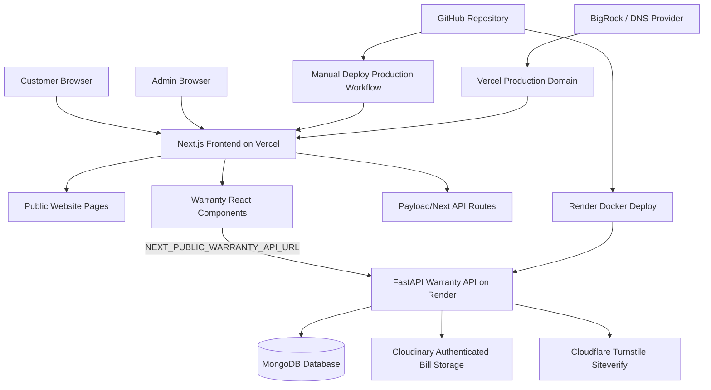
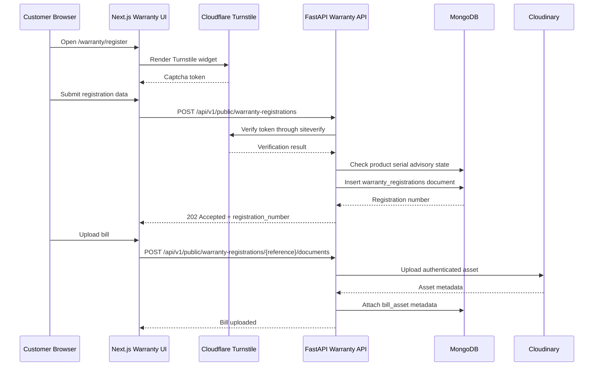
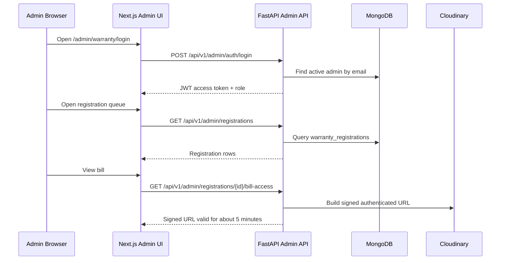
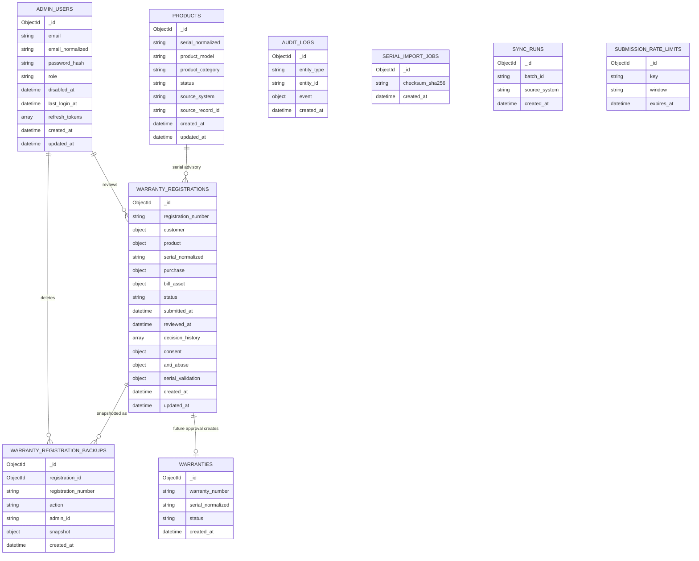

# Limac Warranty Platform Design Document

Last updated: 2026-08-15

## 1. Purpose

This document describes the current Limac website and warranty registration platform architecture, including frontend, backend, database, storage, security, deployment, and future roadmap. It is intended for developers, maintainers, deployment operators, and stakeholders who need a single reference for how the current version works and what is planned next.

Production secrets must not be committed to this repository. Environment values in this document are examples or placeholders only.

## 2. System Overview

The project contains two main runtime surfaces:

- Main public website: Next.js App Router application deployed to Vercel.
- Warranty backend: FastAPI service deployed to Render and backed by MongoDB.

The public warranty pages are part of the Next.js website, but all warranty business logic is handled by the FastAPI backend. The frontend calls the backend through `NEXT_PUBLIC_WARRANTY_API_URL`.

### Key Runtime Components

| Component | Technology | Runtime | Responsibility |
| --- | --- | --- | --- |
| Public website | Next.js, React, TypeScript, Tailwind | Vercel | Marketing pages, product pages, blog, warranty UI |
| Warranty frontend | Next.js client components | Vercel/browser | Registration form, status lookup, admin UI |
| Warranty API | FastAPI, Pydantic, Motor | Render Docker service | Registration, admin auth, review actions, serial import, CSV export |
| Database | MongoDB | Atlas or local Docker | Warranty records, products, admin users, audit/backup data |
| Bill storage | Cloudinary authenticated assets | Cloudinary | Secure warranty bill storage and signed access URLs |
| Captcha | Cloudflare Turnstile | Cloudflare | Public registration bot protection |
| Domain/DNS | BigRock or DNS provider, Vercel DNS records | DNS | Routes public domain to Vercel |
| Production deploy workflow | GitHub Actions + Vercel CLI | GitHub Actions | Manual Vercel production deployment |

## 3. Component Model



## 4. Repository Structure

| Path | Purpose |
| --- | --- |
| `src/app/` | Next.js App Router routes |
| `src/app/(site)/warranty/register/page.tsx` | Public warranty registration route |
| `src/app/(site)/warranty/status/page.tsx` | Public status lookup route |
| `src/app/admin/warranty/login/page.tsx` | Admin login route |
| `src/app/admin/warranty/registrations/page.tsx` | Admin registration queue |
| `src/app/admin/warranty/registrations/[id]/page.tsx` | Admin registration detail |
| `src/app/admin/warranty/users/page.tsx` | Super admin user management |
| `src/components/warranty/` | Warranty frontend components |
| `src/services/warrantyApi.ts` | Browser API client for FastAPI |
| `src/types/warranty.ts` | Frontend warranty contracts |
| `backend/app/` | FastAPI backend source |
| `backend/app/api/public/` | Public warranty API routes |
| `backend/app/api/admin/` | Admin API routes |
| `backend/app/repositories/` | MongoDB repository layer |
| `backend/app/services/` | Business services |
| `backend/app/security/` | Password, JWT, admin auth dependencies |
| `backend/app/storage/` | Cloudinary integration |
| `backend/tests/` | Backend tests |
| `docs/` | Architecture and deployment documentation |

## 5. Feature Specification

### 5.1 Public Warranty Registration

Available in current version:

- Customer submits warranty registration details.
- Required customer fields:
  - Name
  - Address line
  - City
  - State
  - PIN code
  - Mobile number
- Required product/purchase fields:
  - Product serial number
  - Purchase date
  - Invoice number
  - Dealer/shop name
- Optional fields:
  - Product model
  - Dealer code
- Customer must accept warranty terms and privacy policy.
- Cloudflare Turnstile token is required when `TURNSTILE_REQUIRED=true`.
- Backend performs advisory serial validation.
- Backend creates a pending registration with a generated reference number.
- Customer uploads bill/invoice document after registration.
- Supported bill file types:
  - JPG
  - PNG
  - PDF
- Maximum upload size is controlled by `MAX_UPLOAD_BYTES`, currently defaulting to 2 MB.
- Uploaded bills are stored in Cloudinary as authenticated assets.

Planned future version:

- Direct bill upload as part of the first registration submission.
- Stronger rate limiting enforcement using `submission_rate_limits`.
- Customer notification after submission or approval.
- Improved duplicate registration guidance.
- OTP or alternate identity verification only if explicitly approved for a later version.

### 5.2 Public Status Lookup

Available in current version:

- Customer can look up a registration by registration reference.
- Lookup requires either registered mobile number or serial number.
- Response includes:
  - Registration reference
  - Current status
  - Submitted timestamp
  - Masked mobile
  - Masked serial
  - Status message, when available

Planned future version:

- Warranty certificate download after approval.
- Richer customer-facing status timeline.
- WhatsApp/SMS/email notification links if an approved provider is added.

### 5.3 Admin Authentication

Available in current version:

- Admin login with email and password.
- Passwords are hashed with Argon2.
- JWT access tokens are issued by the backend.
- Frontend stores the access token in `sessionStorage`.
- Frontend session timeout is 5 minutes of inactivity.
- Admin roles:
  - `REVIEWER`
  - `APPROVER`
  - `SUPER_ADMIN`
- Initial production super admin can be bootstrapped through Render environment variables when no admin user exists.

Planned future version:

- Refresh token rotation from the frontend.
- Password change flow for the current admin user.
- Admin disable/reactivate flow.
- Audit trail UI for admin activity.
- Multi-factor authentication.

### 5.4 Admin Registration Review

Available in current version:

- Admins can list warranty registrations.
- Queue supports filtering by status.
- Queue supports searching by customer name, mobile number, registration number, and serial.
- Admins can open detail views.
- Admins can view uploaded bills through short-lived signed Cloudinary URLs.
- Admins can update registration status.
- Reason is required for:
  - `REJECTED`
  - `MORE_INFORMATION_REQUIRED`
- Super admins can delete registrations.
- Deleted registrations are removed from the live dashboard but preserved in backup snapshots.
- CSV export includes live records and deleted backup snapshots. Deleted exported rows are marked with `status=DELETED`.

Current statuses:

- `PENDING`
- `UNDER_REVIEW`
- `MORE_INFORMATION_REQUIRED`
- `APPROVED`
- `REJECTED`
- `CANCELLED`

Planned future version:

- Full approval workflow that creates a warranty record.
- Conflict handling when another warranty already exists for a serial.
- Dedicated review-start, approve, reject, and request-information endpoints replacing generic status updates.
- Warranty certificate generation.
- Repair/reconciliation command for partial approval states.

### 5.5 Admin User Management

Available in current version:

- Only `SUPER_ADMIN` can access admin user management APIs.
- Super admins can create:
  - `APPROVER`
  - `SUPER_ADMIN`
- Super admins can reset another admin user's password.
- Frontend protects the users page from rendering to non-super-admin users.

Planned future version:

- Disable/reactivate admin users.
- Role change history.
- Self-service password change.
- Invite flow instead of temporary password creation.

### 5.6 Product Serial Import

Available in current version:

- Super admins can upload CSV/XLSX serial import files.
- Import supports dry-run mode.
- Import service validates required headers.
- Product records are inserted or updated in MongoDB.
- Import checksum is calculated for traceability.

Planned future version:

- Persisted serial import job detail lookup.
- Row-level import report download.
- Scheduled import from ERP/Tally.
- Admin UI for import history.

### 5.7 Integrations

Available in current version:

- Tally integration route scaffold exists behind configuration.
- No outbound warranty notification provider is required in V1.
- Existing website enquiry email may use Resend, but warranty V1 does not depend on email.

Planned future version:

- Tally or ERP product-master sync.
- Notification provider integration.
- Sentry or equivalent production error monitoring.

## 6. Data Flow

### Public Registration Flow



### Admin Review Flow



## 7. Database Design

MongoDB is initialized on backend startup. Index creation is idempotent and handled by `backend/app/database.py`.

### Database Component Model



### Collections and Indexes

| Collection | Important Indexes | Purpose |
| --- | --- | --- |
| `products` | Unique `serial_normalized`; `status, updated_at`; `source_system, source_record_id` | Product master serial validation and imports |
| `warranty_registrations` | Unique `registration_number`; `status, submitted_at`; `serial_normalized, submitted_at`; `purchase.invoice_number`; `anti_abuse.idempotency_hash` | Live registration queue |
| `warranty_registration_backups` | `registration_number, created_at`; `action, created_at`; `created_at` | Snapshot history and deleted export recovery |
| `warranties` | Unique `warranty_number`; unique `serial_normalized`; `status, created_at` | Future approved warranty records |
| `admin_users` | Unique `email_normalized`; `role, disabled_at` | Admin authentication and authorization |
| `audit_logs` | `entity_type, entity_id`; `created_at` | Future audit history |
| `serial_import_jobs` | `checksum_sha256`; `created_at` | Serial import tracking |
| `sync_runs` | Unique `batch_id`; `source_system, created_at` | Future ERP/Tally sync runs |
| `submission_rate_limits` | Unique `key, window`; TTL `expires_at` | Future abuse controls |

### Backup and Deleted Export Design

Current delete behavior:

1. Super admin requests delete.
2. Backend reads the live registration.
3. Backend writes a snapshot to `warranty_registration_backups` with `action=DELETED`.
4. Backend deletes the live document from `warranty_registrations`.
5. Dashboard no longer shows the row.
6. CSV export reads live rows plus deleted backup snapshots.
7. Deleted CSV rows are exported with `status=DELETED`.

## 8. API Design

### Public API

Base prefix: `/api/v1/public`

| Method | Route | Purpose |
| --- | --- | --- |
| `GET` | `/products/{serial}/validation` | Advisory product serial validation |
| `POST` | `/warranty-registrations` | Create pending warranty registration |
| `POST` | `/warranty-registrations/status-lookup` | Customer status lookup |
| `POST` | `/warranty-registrations/{reference}/documents` | Upload bill/invoice |

### Admin API

Base prefix: `/api/v1/admin`

| Method | Route | Required Role | Purpose |
| --- | --- | --- | --- |
| `POST` | `/auth/login` | Active admin | Login |
| `POST` | `/auth/refresh` | Refresh token | Refresh token placeholder/flow |
| `GET` | `/registrations` | Admin | List registration queue |
| `GET` | `/registrations/export.csv` | Super admin | Export live and deleted records |
| `GET` | `/registrations/{id}` | Admin | Registration detail |
| `POST` | `/registrations/{id}/status` | Admin | Update status |
| `DELETE` | `/registrations/{id}` | Super admin | Delete registration with backup |
| `GET` | `/registrations/{id}/bill-access` | Admin | Get signed bill URL |
| `POST` | `/serial-imports` | Super admin | Upload serial import |
| `GET` | `/users` | Super admin | List admin users |
| `POST` | `/users` | Super admin | Create admin user |
| `POST` | `/users/{id}/password` | Super admin | Reset another user's password |

## 9. Security Design

### Authentication and Authorization

- Admin passwords are hashed using Argon2.
- Access tokens are JWTs signed with `JWT_SECRET_KEY`.
- Backend role enforcement is implemented through FastAPI dependencies:
  - `require_admin`
  - `require_super_admin`
- Frontend gates protected admin pages to prevent UI flashes before API rejection.
- Sensitive admin actions are enforced server-side, not only in the UI.

### Captcha

- Cloudflare Turnstile protects public registration.
- Frontend uses `NEXT_PUBLIC_TURNSTILE_SITE_KEY`.
- Backend uses `TURNSTILE_SECRET_KEY`.
- Backend verifies tokens through Cloudflare `siteverify`.
- Local development can set `TURNSTILE_REQUIRED=false`.

### Bill Storage

- Bills are not stored directly in MongoDB.
- Bills are uploaded to Cloudinary as authenticated assets.
- MongoDB stores only asset metadata such as public ID, resource type, checksum, size, folder, and content type.
- Admin bill viewing uses signed URLs that expire after about 5 minutes.

### CORS

Allowed origins are configured in backend settings:

- `http://localhost:3000`
- `http://127.0.0.1:3000`
- `https://www.limac.in`
- `https://limac.in`

## 10. Environment Variables

### Vercel Frontend Variables

| Variable | Purpose |
| --- | --- |
| `NEXT_PUBLIC_SITE_URL` | Public website URL |
| `NEXT_PUBLIC_WARRANTY_API_URL` | Browser-visible FastAPI base URL |
| `NEXT_PUBLIC_TURNSTILE_SITE_KEY` | Cloudflare Turnstile public key |
| `PAYLOAD_URL` | Payload/website runtime URL |
| `PAYLOAD_SECRET` | Payload secret |
| `PAYLOAD_API_KEY` | Optional Payload API key |
| `MONGODB_URI` | Required only if Vercel runtime uses Payload MongoDB |
| `RESEND_API_KEY` | Existing enquiry email integration, not required by warranty V1 |

### Render Backend Variables

| Variable | Purpose |
| --- | --- |
| `ENVIRONMENT=production` | Production mode |
| `MONGODB_URI` | MongoDB connection string |
| `MONGODB_DATABASE=limac` | Database name |
| `JWT_SECRET_KEY` | JWT signing secret |
| `TURNSTILE_REQUIRED=true` | Captcha requirement |
| `TURNSTILE_SECRET_KEY` | Cloudflare Turnstile secret key |
| `CLOUDINARY_CLOUD_NAME` | Cloudinary cloud name |
| `CLOUDINARY_API_KEY` | Cloudinary API key |
| `CLOUDINARY_API_SECRET` | Cloudinary API secret |
| `CLOUDINARY_BILL_FOLDER_ROOT=limac/warranty-bills` | Bill folder root |
| `INITIAL_ADMIN_EMAIL` | Optional first super admin bootstrap email |
| `INITIAL_ADMIN_PASSWORD` | Optional first super admin bootstrap password; remove after bootstrap |

## 11. Deployment and Setup Steps

### 11.1 Local Development

Frontend:

```bash
npm install
npm run dev
```

Backend:

```bash
cd backend
python -m venv .venv
.venv\Scripts\Activate.ps1
pip install -e ".[dev]"
uvicorn app.main:app --reload
```

Local MongoDB option:

```bash
cd backend
docker compose -f docker-compose.mongo.yml up -d
```

Verification:

```bash
npm run build
cd backend
pytest
```

### 11.2 Vercel Frontend Setup

Current repository behavior:

- `vercel.json` disables automatic Git deployment.
- Production deployment is intended to be manual through GitHub Actions.
- `.github/workflows/deploy-production.yml` builds and deploys with Vercel CLI.

Steps:

1. Create or open the Vercel project.
2. Connect it to the GitHub repository.
3. Confirm framework detection as Next.js.
4. Configure build settings:
   - Install command: `npm install`
   - Build command: `npm run build`
   - Output: `.next`
5. Add frontend environment variables in Vercel.
6. Add production domain in Vercel.
7. Confirm `NEXT_PUBLIC_WARRANTY_API_URL` points to the Render backend URL, ending in `/api/v1`.
8. Add GitHub repository secrets:
   - `VERCEL_TOKEN`
   - `VERCEL_ORG_ID`
   - `VERCEL_PROJECT_ID`
9. Run GitHub Actions workflow `Deploy Production`.
10. Confirm production domain loads and warranty pages call the backend successfully.

### 11.3 Render Backend Setup

Current repository behavior:

- `render.yaml` defines a Docker web service named `limac-warranty-api`.
- Service root directory is `backend`.
- Health check path is `/health/live`.
- Dockerfile runs `uvicorn app.main:app --host 0.0.0.0 --port 8000`.

Steps:

1. Create a Render web service from the repository.
2. Select Docker runtime.
3. Set root directory to `backend`.
4. Use the service name `limac-warranty-api` or equivalent.
5. Configure health check path `/health/live`.
6. Add backend environment variables in Render.
7. Deploy service.
8. Confirm health endpoints:
   - `/health/live`
   - `/health/ready`
9. Confirm API prefix:
   - `/api/v1/public/...`
   - `/api/v1/admin/...`
10. If using bootstrap admin variables, remove `INITIAL_ADMIN_PASSWORD` after the first successful startup.

### 11.4 MongoDB Setup

Steps:

1. Create MongoDB database, usually `limac`.
2. Create an application database user with read/write access to that database.
3. Add connection string to Render as `MONGODB_URI`.
4. Add `MONGODB_DATABASE=limac`.
5. Start backend once to allow index creation.
6. Confirm collections and indexes are created.

Collections are created lazily by MongoDB when first written, but indexes are ensured on startup.

### 11.5 Cloudflare Turnstile Setup

Steps:

1. Open Cloudflare Turnstile.
2. Create a widget for the production domain.
3. Add allowed hostnames:
   - `limac.in`
   - `www.limac.in`
   - local development hostnames if needed
4. Copy the site key into Vercel as `NEXT_PUBLIC_TURNSTILE_SITE_KEY`.
5. Copy the secret key into Render as `TURNSTILE_SECRET_KEY`.
6. Set `TURNSTILE_REQUIRED=true` in Render for production.
7. Test public registration.

Local development option:

```env
TURNSTILE_REQUIRED=false
NEXT_PUBLIC_TURNSTILE_SITE_KEY=
```

### 11.6 Cloudinary Setup

Steps:

1. Create or open the Cloudinary account.
2. Get cloud name, API key, and API secret.
3. Add these values to Render:
   - `CLOUDINARY_CLOUD_NAME`
   - `CLOUDINARY_API_KEY`
   - `CLOUDINARY_API_SECRET`
4. Set folder root:
   - `CLOUDINARY_BILL_FOLDER_ROOT=limac/warranty-bills`
5. Backend uploads bills under:
   - `limac/warranty-bills/YYYY/MM`
6. Confirm uploaded assets use authenticated access.
7. Test admin bill preview; backend should return a signed URL.

### 11.7 Domain and DNS Setup

Steps:

1. Add apex and `www` domains in Vercel.
2. In BigRock or the active DNS provider, set records exactly as shown by Vercel.
3. Preserve existing email records unless intentionally migrating email:
   - MX
   - SPF
   - DKIM
   - DMARC
4. Wait for DNS propagation.
5. Confirm Vercel domain status is valid.
6. Test:
   - `https://limac.in`
   - `https://www.limac.in`

### 11.8 GitHub Actions Deployment

Production workflow:

```text
.github/workflows/deploy-production.yml
```

Steps:

1. Open GitHub Actions.
2. Select `Deploy Production`.
3. Click `Run workflow`.
4. Enter `deploy` as confirmation.
5. Workflow installs dependencies, pulls Vercel production environment, builds, and deploys the prebuilt artifact.

Legacy static workflow:

```text
.github/workflows/publish-pages.yml
```

This is manual-only and intended for legacy GitHub Pages static publishing. It hides server-only API routes before static export. It should not be used for the production Vercel runtime site.

## 12. Current Version Summary

Available now:

- Public website on Next.js.
- Public warranty registration page.
- Cloudflare Turnstile integration.
- Public warranty status lookup.
- Cloudinary bill upload and signed admin bill preview.
- FastAPI warranty backend.
- MongoDB indexes and repository layer.
- Admin login.
- Admin registration queue and detail views.
- Admin status update.
- Super admin delete with backup snapshot.
- CSV export including deleted backups as `DELETED`.
- Super admin user creation and password reset.
- Serial import upload and dry-run.
- Render Docker deployment config.
- Manual Vercel production deployment workflow.

Known current limitations:

- Final warranty approval creation is not fully implemented.
- `warranties` and `audit_logs` collections are indexed but not fully used by current approval workflow.
- Admin refresh token flow is incomplete from the frontend perspective.
- Serial import job lookup endpoint is not persisted yet.
- No warranty notification provider is implemented in V1.
- Tally integration is a scaffold, not an active production sync.

## 13. Future Version Roadmap

### V1 Hardening

- Persist and expose serial import job history.
- Add backend tests for all admin role permissions.
- Add frontend end-to-end tests for public registration and admin review.
- Improve admin session refresh behavior.
- Add admin disable/reactivate.
- Add audit log writes for admin actions.

### V2 Approval and Warranty Issuance

- Implement explicit approval endpoints.
- Create warranty records with unique warranty numbers.
- Enforce one active warranty per normalized serial.
- Generate downloadable warranty certificates.
- Add customer-facing approved warranty lookup.
- Add conflict resolution UI.

### V3 Integrations and Operations

- Tally/ERP product-master sync.
- Notification provider integration.
- Sentry or equivalent monitoring.
- Scheduled data consistency checks.
- Admin analytics dashboard.
- Role-specific dashboards for reviewer and approver workflows.

## 14. Validation Commands

Backend:

```bash
cd backend
.venv\Scripts\python.exe -m pytest
```

Frontend:

```bash
npm run build
```

Current verified state after recent changes:

- Backend tests passed: `10 passed`
- Frontend build passed: `npm run build`

